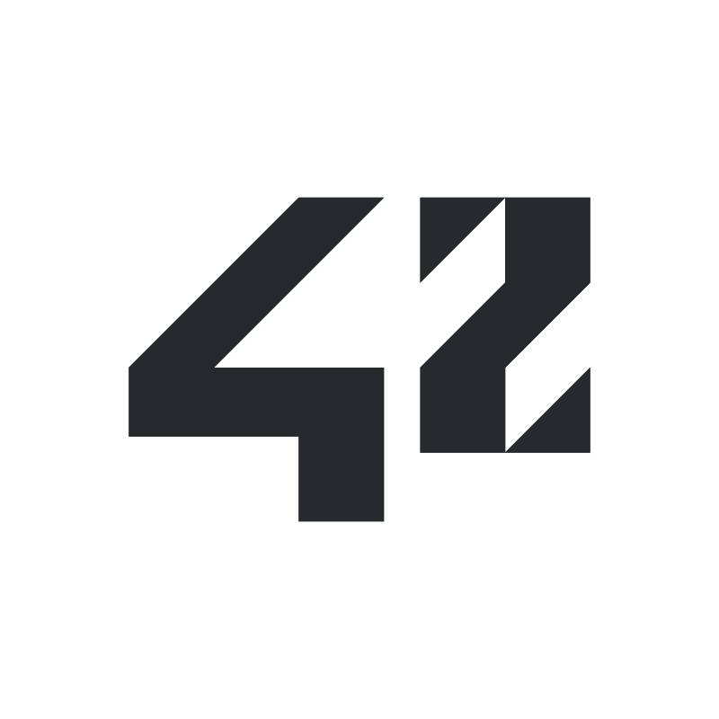

## :rocket: About Me

I'm Lachlan Stephen, a current student at [**42 Adelaide**](https://www.42adel.org.au/), and an aspiring **Software Engineer**. I've had experience as a **Front End Web Developer** for about 3 years, and am currently freelancing on the side of my studies for a couple of clients.

- :hammer_and_wrench: I'm currently working on organising my professional profiles and Philosophers (42 Project)

- :book: I'm currently learning about multi-threaded programs in C and 3D animations (WebGL, three.js)

- :camera: My hobbies and interests include photography, cooking, sports, puzzles and working on my car 

- Ask me about fractals, CSS tricks, football, life as a 42Adelaide Student, and anything in-between!

:bulb: Inspired by: [Active Theory](https://activetheory.net/) 
- They make awe-inspiring designs come to life with code, and test the boundary for what's possible. Check out their website and portfolio, you won't be disappointed.

## :sparkles: Languages and Tools

## &ensp;[My 42 Projects](https://github.com/stars/lachlanstephen/lists/42-projects)

### :cyclone: [fract-ol](https://github.com/lachlanstephen/fract-ol_42)

- A project about creating graphically beautiful fractals. It delved into the notion of complex numbers, optimisation in graphics, and event handling.
- 105/100

### :books: [LIBFT](https://github.com/lachlanstephen/LIBFT_42)

- A C library containing general purpose functions for future projects.
- 125/100

### :earth_asia: [All projects](https://github.com/stars/lachlanstephen/lists/42-projects)

## :trophy: Achievements

:herb: **Honourable Mention: GovHack 2023** - Amp up SA: Forecasting Electric Transport for Grid Resilience

- My Project: [Energy4me](https://2023.hackerspace.govhack.org/projects/energy4me)
- The idea of an application that pulls data from the Australian National Energy Market, to better educate users on the most renewable times to use electricity.

## :speech_balloon: Find me

&ensp;
&ensp;

##
All credit to <a href="https://portaly.cc/pixeljeff" rel="noopener noreferrer nofollow">Pixel Jeff</a> for the <a href="https://www.behance.net/gallery/103154127/SUDIO" rel="noopener noreferrer nofollow">banner</a>!